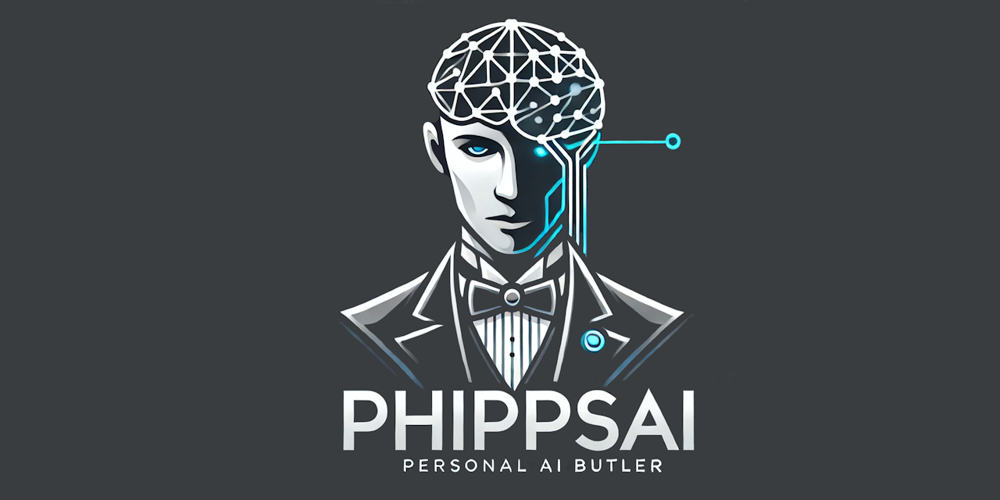

  
[](https://discord.gg/tPWjMwK)
[](https://bsky.app/profile/tinybiggames.com)  

PhippsAI is an **🧪 experimental** project that integrates **💻 local generative AI** with real-time **🌐 web search capabilities** using function calling. The system is powered by **🧠 DeepSeek R1**, running locally via **llama.cpp**, and employs **🔍 Tavily** for live web searches.

## 🚀 Features
- 🏠 **Local AI Model**: Runs **DeepSeek R1 Distill Llama 8B**, a distilled version of **Llama 3.1 8B**.
- ⚡ **Function Calling Support**: Allows the model to trigger web search actions when necessary.
- 🌐 **Real-Time Web Search**: Uses **Tavily** to fetch up-to-date information dynamically.
- 🏎️ **Optimized for Efficiency**: Leveraging **llama.cpp**, enabling fast and efficient execution on local hardware.
- 🌍 **Cross-Language Support**: Built as a **Win64 Unicode DLL**, making it compatible with any language via DLL bindings.
- 🎯 **Developed in Delphi**: Requires Delphi 12.2 for building the DLL, but a prebuilt, ready-to-use DLL is included in the repository.

## 📥 Model Requirements

### 📌 Required Model
To run **PhippsAI**, you must use the following model:

- **🧠 Model Name**: `deepseek-r1-distill-llama-8b-abliterated-q4_k_m.gguf`
- 📥 **Download Link**: [🔗 Hugging Face Repository](https://huggingface.co/tinybiggames/DeepSeek-R1-Distill-Llama-8B-abliterated-Q4_K_M-GGUF/resolve/main/deepseek-r1-distill-llama-8b-abliterated-Q4_K_M-GGUF?download=true)

### 📝 Model Overview
- This model is a **distilled** version of **Llama 3.1 8B**.
- It supports **🔧 function calling**, which is necessary for web search functionality.

## 🌍 Web Search Integration

### 🛠️ Implemented Tool: Web Search
- The AI model can **⚙️ call functions** to perform real-time web searches as needed.
- The web search tool is powered by **Tavily**, enabling quick and accurate online information retrieval.

### ⚙️ Setting Up Web Search
To enable **🌐 web search capabilities**, you need to set up a **Tavily** account:
- 📝 Sign up for a free **Tavily** account: [🔗 Tavily Website](https://tavily.com/)
- 🔑 Obtain your **Tavily API key** after signing up.

### 🔧 Setting the API Key
There are two ways to provide the **Tavily API key** to PhippsAI:

#### **🛠️ Option 1: Set API Key in Code**
Call the following function:
```delphi
phSetSearchAPIKey('YOUR_TAVILY_APIKEY')
```

#### **🌍 Option 2: Use an Environment Variable**
Set an **environment variable** for your API key:
- Create a new environment variable named **`TAVILY_API_KEY`**.
- Assign it your **Tavily API key**.

If the API key is not manually provided, the system will automatically attempt to retrieve it from the environment variable.

## 🚀 Getting Started

### 📥 1. Download PhippsAI
Download **PhippsAI** from the **GitHub repo**:  
- [Download PhippsAI](https://github.com/tinyBigGAMES/PhippsAI/archive/refs/heads/main.zip)
- Add `PhippsAI` bindings to your project from the `lib` folder.

### 📥 2. Download the Model
Download the **DeepSeek R1** model file from the provided **Hugging Face** link and store it in the appropriate directory.  
📂 The examples use `C:/LLM/GGUF`.

### 🔧 3. Configure Web Search
If you want to enable **real-time web search**, set up your **Tavily API key** as described above.  
✅ We recommend the environment variable option.

### ▶️ 4. Run the Examples
Run the provided examples to see **PhippsAI** in action!

**NOTE:** This project is experimental and still a work in progress. There are known issues with function calling. At times, the model may attempt to reason out of a function call when it should simply execute it. Occasionally, it successfully calls the web search but displays the results with formatting errors. These and other similar edge cases are ongoing issues that still need to be addressed.

## 📺 Media


https://github.com/user-attachments/assets/9f7a8fc5-8888-4e82-ad73-d7239993c245


## 🛠️ Support and Resources

- 🐞 **Report issues** via the [Issue Tracker](https://github.com/tinyBigGAMES/PhippsAI/issues).
- 💬 **Engage in discussions** on the [Forum](https://github.com/tinyBigGAMES/PhippsAI/discussions) and [Discord](https://discord.gg/tPWjMwK).
- 📚 **Learn more** at [Learn Delphi](https://learndelphi.org).

## 🤝 Contributing  

Contributions to **✨ PhippsAI** are highly encouraged! 🌟  
- 🐛 **Report Issues:** Submit issues if you encounter bugs or need help.  
- 💡 **Suggest Features:** Share your ideas to make **PhippsAI** even better.  
- 🔧 **Create Pull Requests:** Help expand the capabilities and robustness of the library.  

Your contributions make a difference! 🙌✨

#### Contributors 👥🤝
<br/>

<a href="https://github.com/tinyBigGAMES/PhippsAI/graphs/contributors">
  
</a>

## 📜 Licensing

**PhippsAI** is distributed under the **🆓 BSD-3-Clause License**, allowing for redistribution and use in both source and binary forms, with or without modification, under specific conditions.  
See the [📜 LICENSE](https://github.com/tinyBigGAMES/PhippsAI?tab=BSD-3-Clause-1-ov-file#BSD-3-Clause-1-ov-file) file for more details.

---

🏰 **Enhance your experience with PhippsAI – Your AI Butler, always at your service 🤖☕.**  

<p align="center">

</p>
<h5 align="center">
  
Made with ❤️ in Delphi  
